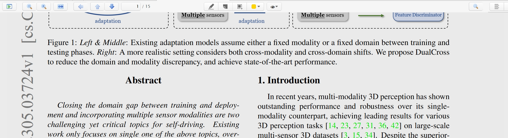

# Zotero PDF Background Plugin

Install by downloading the [latest version](https://github.com/attr0/zotero-pdf-background/releases/latest)

## What is updated compared to original one?

- Brighter Night Mode
- Fix background-coloring missing problem in spread mode (multiple pages in one row)

## Feature

* a multi pdf background to care your eyes
* a button like a eye on the middle toolbar to switch different background mode

## Todo

* add DIY background color function(Maybe)

## Install

- Download zotero-pdf-backgroundv0.0.2.zip
- Open Zotero->tools->plugins->click setting icon on right top->Install Addon from file...
- Select zotero-pdf-backgroundv0.0.2.zip file
- Restart Zotero

## Thanks
This plugin's framework is based on [zotero-night](https://github.com/tefkah/zotero-night)